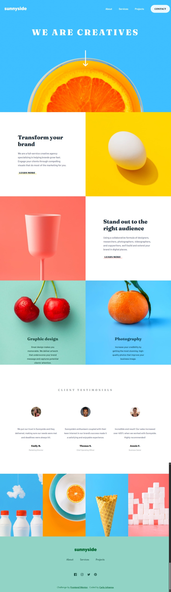
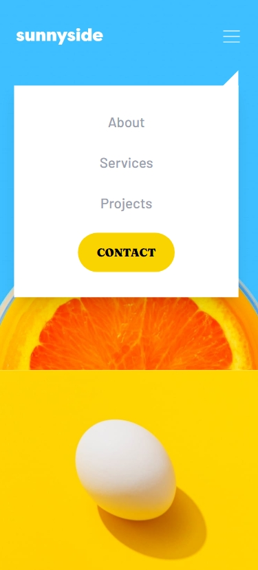

# Sunnyside agency landing page solution

This is a solution to the [Sunnyside agency landing page challenge on Frontend Mentor](https://www.frontendmentor.io/challenges/sunnyside-agency-landing-page-7yVs3B6ef). Frontend Mentor challenges help you improve your coding skills by building realistic projects.

## Table of contents

- [Overview](#overview)
  - [The challenge](#the-challenge)
  - [Screenshot](#screenshot)
  - [Links](#links)
- [My process](#my-process)
  - [Built with](#built-with)
  - [What I learned](#what-i-learned)
  - [Continued development](#continued-development)
  - [Useful resources](#useful-resources)
  - [Deployment & Setup](#deployment--setup)
- [Author](#author)
- [Acknowledgments](#acknowledgments)

## Overview

### The challenge

Create a landing page that closely resembles the final design.

Your users should be able to:

- View the optimal site design for their device's screen size
- See the hover state of all interactive elements on the page

### Screenshot

  
  &nbsp;&nbsp;&nbsp;&nbsp;&nbsp;&nbsp;
  
  &nbsp;&nbsp;&nbsp;&nbsp;&nbsp;&nbsp;
  

## Author

- Website - [Carla Johanna](https://github.com/devcjoha)
- Frontend Mentor - [@devcjoha](https://www.frontendmentor.io/profile/devcjoha)
- X - [@CarlitaJohanna](https://www.x.com/carlitajohana)

## 🚀 Live Deploys

- 📂 [Solution on GitHub](https://github.com/devcjoha/sunnyside-agency-landing-page)  
- 🌐 [Live Site on GitHub Pages](https://devcjoha.github.io/sunnyside-agency-landing-page/)

## My process

### Built with

 &nbsp;&nbsp;&nbsp;&nbsp;&nbsp;&nbsp;

 &nbsp;&nbsp;&nbsp;&nbsp;&nbsp;&nbsp;

 &nbsp;&nbsp;&nbsp;&nbsp;&nbsp;&nbsp;

 &nbsp;&nbsp;&nbsp;&nbsp;&nbsp;&nbsp;

 &nbsp;&nbsp;&nbsp;&nbsp;&nbsp;&nbsp;

 &nbsp;&nbsp;&nbsp;&nbsp;&nbsp;&nbsp;

- React (component-based architecture).
- Vite (development and packaging).
- Tailwind custom propertie, theme dark/light.
- Responsive design.
- Vite plugin svgr.

### 👩🏻‍💻 What I learned
- I used **Power Toys tools**, which were very useful for taking measurements, adjusting colors, and more.  
- I reinforced my knowledge of **flexbox grids**, improving layout consistency and responsiveness.  
- I discovered a new way to work with **SVG images**, applying styles directly and optimizing their use in components.  
- I enjoyed the design adjustment process, especially refining details for better visual balance.  
- The **sidebar design** was a challenge, but I managed to solve it quickly with a clean approach. 

### 💥 Continued development
- Add **animations** for smoother user experience.  
- Improve **accessibility** (ARIA labels, keyboard navigation).  
- Explore **Next.js** for SSR/SSG and SEO improvements.

### 🔗 Useful resources
* Tailwind docs
* GitHub Pages deployment guides
* Vite + React integration tips
* Power Toys

## Author

- Website - [Carla Johanna](https://github.com/devcjoha)
- Frontend Mentor - [@devcjoha](https://www.frontendmentor.io/profile/devcjoha)
- X - [@CarlitaJohanna](https://www.x.com/carlitajohana)